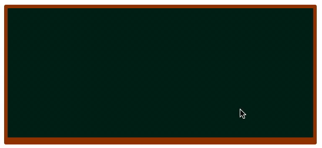

# Bart Board

## Assignment

In this exercise you will create a "BartBoard". It is the blackboard in the Simpson intro that we are trying to create.

### Functional requirements:

- [ ] When the mouse button is pressed down, and the mouse pointer is positioned over the black board, a text should appear letter by letter on the black board.
- [ ] When the mouse button is released or the mouse pointer leaves the component, the text writing should stop.
- [ ] When the sentence is written once, it should start over.
- [ ] When the board is full, the web component should trigger a synthetic event named `filled`. 
- [ ] The speed should be controlled using the attribute "speed". `speed="50"`should write approximately 20 characters per second. (50 ms per character)
- [ ] The user of the component should be able to wipe the board by calling the method `clear()`.

### Non-functional requirements:

- [ ] You should create a reusable Web Component with all files required for the Bartboard to work in the folder 'src/components/bart-board/'
- [ ] The component should be well documented in the provided README.md (Already provided as an example)

